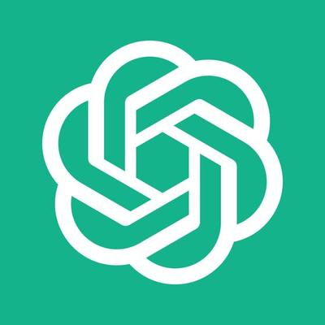

<!-- Improved compatibility of back to top link: See: https://github.com/othneildrew/Best-README-Template/pull/73 -->

<!-- PROJECT LOGO -->
 

  

  <h3 align="center">Shuan's Blog - Ex*</h3>

  

    An awesome public playground that can record your life and share your knowledge!
     
    <a href="https://github.com/IamWilson1209/chat-ai"><strong>Explore the docs »</strong></a>
     
     
  

<!-- TABLE OF CONTENTS -->

  
Table of Contents

  <ol>
    <li>
      <a href="#about-the-project">About The Project</a>
      <ul>
        <li><a href="#built-with">Built With</a></li>
      </ul>
    </li>
    <li><a href="#details">Details</a></li>
    <li><a href="#roadmap">Roadmap</a></li>
    <li><a href="#contact">Contact</a></li>
  </ol>

<!-- ABOUT THE PROJECT -->
## About The Project

This chat app designed for any team with LLM agents need, the open ai agents can be replaced by any self-training agents.

(<a href="#readme-top">back to top</a>)

### Built With

(<a href="#readme-top">back to top</a>)

<!-- USAGE EXAMPLES -->
## Details

- A real-time AI-integrated chat application using Next.js and Convex, with Convex handling real-time messaging instead of traditional WebSocket streaming.
- Integrated Clerk for user authentication, leveraging webhooks to manage login/logout events and interact with Convex’s cloud database. Enabled features including one-on-one chat, group chat, messaging, and video calls (via Zegocloud).
- Fully integrated OpenAI GPT-3.5-Turbo into chat rooms for on-demand assistance, similar to ChatGPT, and incorporated DALL·E 3 for image generation via prompts. Designed this chat MVP is expected to boost any work team efficiency, with plans to adapt custom AI agents to specific work environments. 
- Utilized Redux for global state management and Next.js Cache for data-fetching performance optimization.

(<a href="#readme-top">back to top</a>)

<!-- ROADMAP -->
## Roadmap

- [x] Realtime message sending
- [x] Open AI agent integration
- [ ] Chat search
- [ ] Delete Chat

(<a href="#readme-top">back to top</a>)

<!-- CONTACT -->
## Contact

Wei-Shiuan Lee - [@linkedin](https://www.linkedin.com/in/weishiuan/) - zenfonlee@gmail.com

Project Link: [https://github.com/IamWilson1209/shuan-blog](https://github.com/IamWilson1209/shuan-blog)

(<a href="#readme-top">back to top</a>)

